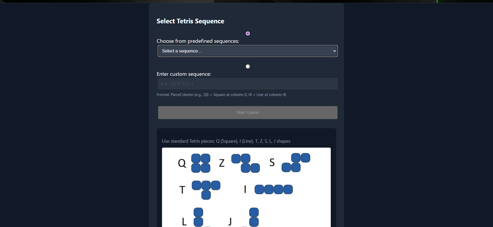

## Tetris Game | Full-Stack Application (FastAPI + React + Kubernetes + AWS)



A fully containerized, cloud-ready Tetris simulation engine with:

- FastAPI backend (Python) implementing complete Tetris game logic..

- React + TypeScript frontend for real-time visualization..

- Dockerized backend & frontend..

- Kubernetes deployments (local + AWS EKS)..


This project demonstrates end-to-end full-stack + DevOps capability, suitable for interviews and production-grade architecture.
Implements full Tetris mechanics:
- Piece movement, collisions, boundaries
- Line clearing
- Height calculation

API Endpoints:..

    - GET /sequences → predefined sequences
    
    - POST /game/start → start simulation
    
    - POST /game/{id}/next → place next piece
    
    - GET /game/{id} → current game state
    

## 🐳 Dockerized

Backend & Frontend each have their own Dockerfile. You can run the full stack using:

- docker-compose up --build

## ☸️ Kubernetes Ready

Includes manifests for:
- Local deployment (NGINX ingress)
- AWS EKS deployment (ALB ingress)

Supports:

- Probes (Liveness/Readiness)
- Resource Limits
- Replicas
- Namespace isolation

## ☁️ AWS EKS Deployment

Fully automated using:

- aws-deploy.sh / aws-deploy.ps1 → Build Docker images, push to ECR, create EKS cluster
- deploy-to-aws.ps1 → Deploy application to AWS
- cloudshell-deploy.sh & cloudshell-app-deploy.sh → One-click deployment from AWS CloudShell

Creates:

- ECR Repositories
- EKS Cluster
- AWS Load Balancer Controller
- ALB Ingress with DNS hostname
```bash
# Local Development

1. Clone the repo
   git clone https://github.com/YOUR-USERNAME/TETRIS-REPO.git
   cd tetris-game

Option A — Run Locally (Dev Mode):

Backend:
  cd backend
  uvicorn main:app --reload --port 8000

Frontend:
  cd frontend
  npm install
  npm run dev

Frontend will run on: http://localhost:5173
Backend will run on:  http://localhost:8000

Option B — Run with Docker Compose (Recommended)
  docker-compose up --build

Opens at:
Frontend: http://localhost:3000

Backend: http://localhost:8000

Option C — Run on Kubernetes (local cluster)
Deploy:
./deploy.sh       # Linux/Mac
.\deploy.ps1      # Windows

Access:
kubectl port-forward svc/tetris-frontend-service 3000:80 -n tetris-game

☁️ Deploy to AWS EKS
1. Build & push docker images + create cluster

Linux/Mac

./aws-deploy.sh


Windows

.\aws-deploy.ps1

2. Deploy the actual application
.\deploy-to-aws.ps1
```

This will:
- ✔ Update manifests with correct ECR URLs
- ✔ Deploy backend + frontend
- ✔ Deploy ALB ingress
- ✔ Print the public URL

🧾 License

MIT License — free to use, modify, and distribute.
